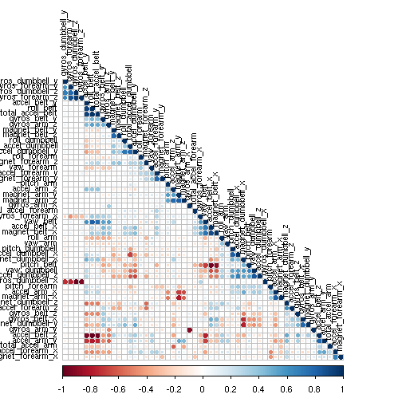
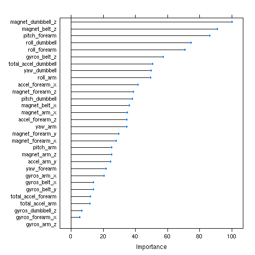

### Executive Summary
Research, evaluate and apply machine learning to predict the manner in which participants did the exercise from Human Activity Recognition(HAR) data set from Groupware (See reference)

## Data source
groupware@les(http://groupware.les.inf.puc-rio.br/har) pis the data provider. The training data set is here (https://d396qusza40orc.cloudfront.net/predmachlearn/pml-training.csv).
The test data is here(https://d396qusza40orc.cloudfront.net/predmachlearn/pml-testing.csv)


```r
train.url <- 'https://d396qusza40orc.cloudfront.net/predmachlearn/pml-training.csv'
test.url <- 'https://d396qusza40orc.cloudfront.net/predmachlearn/pml-testing.csv'
download.file(train.url, paste('./data/','pml-training.csv',sep=''), method='wget')
download.file(test.url, paste('./data/','pml-testing.csv', sep=''),     method='wget')
```

## Data Cleansee
Eye balling dataset shows 'NA', "", and "#DIV/0!" are empty data. Lots of empty or mostly empty columns.
Also participants names, timestamps and windows are not from device, so remove those columnes.

```r
rm(list=ls())
traindata <- read.csv(file='data/pml-training.csv', header=T, stringsAsFactors=TRUE, na.strings=c("NA", "", "#DIV/0!"))
result<-traindata$classe
testdata <- read.csv(file='data/pml-testing.csv', header=T, stringsAsFactors=TRUE, na.strings=c("NA", "", "#DIV/0!"))
```
Find out which columns are empty(NA, null, DIV/0) or mostly empty and remove them. Replace empty entries with mean for "not so empty columns". Mostly empty columns as morethan 45% empty.

```r
emptycols <- sapply(traindata, function(x)all(is.na(x)))
#remove all empty columns
traindata<-traindata[,-which(emptycols)]
#remove mostly empty columns
emptycol <- function(x) {
    numMissing <-length(which(is.na(x)))
    numCells <- length(x)
    numMissing/numCells
}
mostlyemptycols <- sapply(traindata, FUN=emptycol)
traindata<-traindata[,-which(mostlyemptycols>0.45)]
# remove names, timestamp etc
redudantcols <- c(which(colnames(traindata)=='user_name'),
which(colnames(traindata)=='raw_timestamp_part_1'),which(colnames(traindata)=='raw_timestamp_part_2'),which(colnames(traindata)=='cvtd_timestamp'),which(colnames(traindata)=='new_window'),which(colnames(traindata)=='num_window'))
traindata <- traindata[,-redudantcols]
# intersection of column names from train and test data
cmn <- intersect(names(traindata),names(testdata))
traindata <- traindata[,cmn]
testdata <- testdata[, cmn]
traindata <- traindata[,-c(which(colnames(traindata)=='X'))]
testdata <- testdata[,-c(which(colnames(testdata)=='X'))]
# add back the result
traindata$classe<-result
```
"Test data" set from groupware is for evaluation of final model. We partion the 
"Training data" into local train and local test data sets for buildig model.
We use a 70, 30 split.

```r
require(caret) || install.packages(caret)
```

```
## [1] TRUE
```

```r
set.seed(12312014)
trainingIndex  <- createDataPartition(traindata$classe, p=.70, list=FALSE)
training.train <- traindata[ trainingIndex,]
training.test  <- traindata[-trainingIndex,]
```
## Exploratory Analysis
Find out which factors are strongly correlated to each orderby some plotting
Plot variables. To reduce dimension and give up accuracy in order to speed up
calculation, remove factors that are at least 0.7 correlated.

```r
require(caret) || install.packages(caret)
```

```
## [1] TRUE
```

```r
require(corrplot) || install.packages(corrplot)
```

```
## [1] TRUE
```

```r
require(kernlab) || install.packages(kernlab)
```

```
## [1] TRUE
```

```r
require(knitr) || install.packages(knitr)
```

```
## [1] TRUE
```

```r
require(randomForest) || install.packages(randomForest)
```

```
## [1] TRUE
```

```r
correlMatrix <- cor(training.train[, -length(training.train)])
corrplot(correlMatrix, order = "hclust", method = "circle", type = "lower", tl.cex = 0.8,  tl.col = rgb(0, 0, 0))
```

 

```r
highlyCor <- findCorrelation(correlMatrix, 0.70)
training.train <- training.train[, -highlyCor]
training.test  <- training.test[, -highlyCor] 
testdata <- testdata[, -highlyCor]
```
## Machine Learning Method


```r
random.forest <- train(training.train[,-c(which(colnames(training.train)=='classe'))],
                       training.train$classe,
                       tuneGrid=data.frame(mtry=3),
                       trControl=trainControl(method="none")
                       )
```

## Diagnosis and Evaluation


```r
summary(random.forest)
```

```
##                 Length Class      Mode     
## call                4  -none-     call     
## type                1  -none-     character
## predicted       13737  factor     numeric  
## err.rate         3000  -none-     numeric  
## confusion          30  -none-     numeric  
## votes           68685  matrix     numeric  
## oob.times       13737  -none-     numeric  
## classes             5  -none-     character
## importance         30  -none-     numeric  
## importanceSD        0  -none-     NULL     
## localImportance     0  -none-     NULL     
## proximity           0  -none-     NULL     
## ntree               1  -none-     numeric  
## mtry                1  -none-     numeric  
## forest             14  -none-     list     
## y               13737  factor     numeric  
## test                0  -none-     NULL     
## inbag               0  -none-     NULL     
## xNames             30  -none-     character
## problemType         1  -none-     character
## tuneValue           1  data.frame list     
## obsLevels           5  -none-     character
```

```r
# confusion matrix
confusionMatrix(predict(random.forest,
                        newdata=training.test[,-c(which(colnames(training.test)=='classe'))]
                ),
                training.test$classe
                )
```

```
## Confusion Matrix and Statistics
## 
##           Reference
## Prediction    A    B    C    D    E
##          A 1673   13    0    0    0
##          B    0 1121   13    0    0
##          C    0    5 1007   30    2
##          D    1    0    6  933    3
##          E    0    0    0    1 1077
## 
## Overall Statistics
##                                           
##                Accuracy : 0.9874          
##                  95% CI : (0.9842, 0.9901)
##     No Information Rate : 0.2845          
##     P-Value [Acc > NIR] : < 2.2e-16       
##                                           
##                   Kappa : 0.9841          
##  Mcnemar's Test P-Value : NA              
## 
## Statistics by Class:
## 
##                      Class: A Class: B Class: C Class: D Class: E
## Sensitivity            0.9994   0.9842   0.9815   0.9678   0.9954
## Specificity            0.9969   0.9973   0.9924   0.9980   0.9998
## Pos Pred Value         0.9923   0.9885   0.9646   0.9894   0.9991
## Neg Pred Value         0.9998   0.9962   0.9961   0.9937   0.9990
## Prevalence             0.2845   0.1935   0.1743   0.1638   0.1839
## Detection Rate         0.2843   0.1905   0.1711   0.1585   0.1830
## Detection Prevalence   0.2865   0.1927   0.1774   0.1602   0.1832
## Balanced Accuracy      0.9982   0.9907   0.9869   0.9829   0.9976
```

```r
plot(varImp(random.forest))
```

 
Overall Statistics
Accuracy : 0.9874          
95% CI : (0.9842, 0.9901)
P-Value [Acc > NIR] : < 2.2e-16       
Kappa : 0.9841          

## Prediction on TestData

```r
result <-predict(random.forest, testdata)
pml_write_files <- function(x){
  n = length(x)
  for(i in 1:n){
    filename = paste0("problem_id_",i,".txt")
    write.table(x[i],file=filename,quote=FALSE,row.names=FALSE,col.names=FALSE)
  }
}

pml_write_files(result)
```
## Reference
* groupware@les (http://groupware.les.inf.puc-rio.br/har)
* Wearable Computing: Accelerometers’ Data
Classification of Body Postures and Movements (http://groupware.les.inf.puc-rio.br/public/papers/2012.Ugulino.WearableComputing.HAR.Classifier.RIBBON.pdf)
